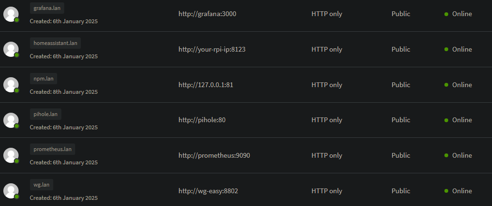

# docker-raspberry-pi-tools

Collection of Docker Compose configurations and scripts tailored for efficient deployment and management of applications on Raspberry Pi.

# Table of contents

- [docker-raspberry-pi-tools](#docker-raspberry-pi-tools)
- [Table of contents](#table-of-contents)
  - [Pre-requisites](#pre-requisites)
    - [Docker Installation for Raspberry Pi](#docker-installation-for-raspberry-pi)
    - [Config Folder Setup](#config-folder-setup)
      - [Setting Proper Permissions (Optional)](#setting-proper-permissions-optional)
  - [Environment Variables](#environment-variables)
  - [Nginx Proxy Manager Configuration](#nginx-proxy-manager-configuration)
    - [Configuration for .lan Domains](#configuration-for-lan-domains)
  - [Tools Used](#tools-used)
  - [Common Problems](#common-problems)
    - [Docker stats doesn't report memory usage](#docker-stats-doesnt-report-memory-usage)
    - [Bandwidth issues between a WireGuard Peer and a WireGuard server](#bandwidth-issues-between-a-wireguard-peer-and-a-wireguard-server)
  - [Additional Notes](#additional-notes)

## Pre-requisites

### Docker Installation for Raspberry Pi

To install Docker on a Raspberry Pi with a 64-bit operating system, follow the instructions provided in the official Docker documentation:

[Docker Engine Installation for Debian](https://docs.docker.com/engine/install/debian/)

### Config Folder Setup

To store configuration data for your containers, create the following folder structure:

```
config/
    npm
    letsencrypt
    wireguard
    home-assistant
```

These directories will serve as local paths for the containerized services' data.

#### Setting Proper Permissions (Optional)

To ensure smooth operation and avoid permission-related issues, assign the correct ownership and permissions to the config/ folder and its subdirectories. Run the following commands:

```bash
sudo chown -R $USER:$USER ./config
sudo chmod -R 755 ./config
```

## Environment Variables

To run this project, you need to define the following environment variables in an `.env` file located in the root directory of your project.

```dotenv
## Grafana

GF_SECURITY_ADMIN_USER=your_user
GF_SECURITY_ADMIN_PASSWORD=your_pass
GF_USERS_ALLOW_SIGN_UP=false

GF_PATHS_CONFIG=/etc/grafana/grafana.ini
GF_PATHS_DATA=/var/lib/grafana
GF_PATHS_HOME=/usr/share/grafana
GF_PATHS_LOGS=/var/log/grafana
GF_PATHS_PLUGINS=/var/lib/grafana/plugins
GF_PATHS_PROVISIONING=/etc/grafana/provisioning
GF_DASHBOARDS_DEFAULT_HOME_DASHBOARD_PATH=/etc/grafana/provisioning/dashboards/rpi-monitoring.json

## InfluxDB
#INFLUXDB_DB=prometheus # Change influxdb db on prometheus.yml if you change this
#INFLUXDB_ADMIN_USER=your_user
#INFLUXDB_ADMIN_PASSWORD=your_pass

## wg-easy
# ⚠️ Change the server's hostname (clients will connect to):
WG_HOST=your.domain.com
# ⚠️ Change the Web UI Password (https://github.com/wg-easy/wg-easy/blob/master/How_to_generate_an_bcrypt_hash.md):
PASSWORD_HASH=your_ui_pass
# 💡 This is the Pi-Hole Container's IP Address
WG_DEFAULT_DNS=172.30.0.3
## For split tunnel use
# WG_ALLOWED_IPS=192.168.0.0/24,10.8.0.0/24
WG_PERSISTENT_KEEPALIVE=25
PORT=your_port
WG_PORT=your_port
# Optional:
# WG_DEFAULT_ADDRESS=10.8.0.x
# WG_MTU=1420
# WG_PERSISTENT_KEEPALIVE=25
# WG_PRE_UP=echo "Pre Up" > /etc/wireguard/pre-up.txt
# WG_POST_UP=echo "Post Up" > /etc/wireguard/post-up.txt
# WG_PRE_DOWN=echo "Pre Down" > /etc/wireguard/pre-down.txt
# WG_POST_DOWN=echo "Post Down" > /etc/wireguard/post-down.txt
# UI_TRAFFIC_STATS=true
# UI_CHART_TYPE=0 # (0 Charts disabled, 1 # Line chart, 2 # Area chart, 3 # Bar chart)

## Pi-hole
TZ=your_timezone
WEBPASSWORD=your_web_password
FTLCONF_LOCAL_IPV4=your_raspberry_pi_ipv4

## Watchtower
# TZ variable is already defined on pihole
WATCHTOWER_CLEANUP=true
WATCHTOWER_HTTP_API_METRICS=true
# TODO: Watchtower token env var seems to have a bug on prometheus.yml, change this constant if you want
WATCHTOWER_HTTP_API_TOKEN=nVDwNXfZiSVpYz97kdVk
# scheduled for 1am each day
WATCHTOWER_SCHEDULE="0 0 1 * * *"
# Optional
# If you want notifications via discord, slack, etc
WATCHTOWER_NOTIFICATION_REPORT=true
WATCHTOWER_NOTIFICATION_URL="discord://token@channel"
# monitor only for testing purposes
#WATCHTOWER_MONITOR_ONLY=true
```

## Nginx Proxy Manager Configuration

Once your Docker container is running, you can access the Nginx Proxy Manager (NPM) admin interface on port **81**. Keep in mind that the initial setup might take some time due to key generation.

Access the admin interface:

```
http://127.0.0.1:81

Default Admin User:

Email:    admin@example.com
Password: changeme
```

Upon your first login with the default credentials, you will be prompted to update your account details and set a new password. Be sure to complete this step to secure your installation.

### Configuration for .lan Domains

To ensure `.lan` domains function properly on your machine, configure Nginx Proxy Manager as shown below:

<p align="center">
	
</p>

**Important:** Enable **WebSocket support** for the Home Assistant domain. This is necessary for Home Assistant to function correctly.

## Tools Used

- **[nginx-proxy-manager](https://nginxproxymanager.com)**: A reverse proxy using NGINX to automatically route HTTP requests to Docker containers based on environment variables.

- **[Grafana](https://grafana.com/docs/)**: Platform for monitoring and observability with customizable dashboards.

- **[Prometheus](https://prometheus.io/docs/introduction/overview/)**: Systems monitoring and alerting toolkit, optimized for time-series data.

- **[InfluxDB](https://docs.influxdata.com/influxdb/v1.8/introduction/)**: Time-series database for handling metrics and events with high write and query loads.

- **[Node Exporter](https://prometheus.io/docs/guides/node-exporter/)**: Prometheus exporter for hardware and OS metrics from \*NIX systems.

- **[cAdvisor](https://github.com/google/cadvisor)**: Daemon for monitoring and analyzing resource usage of running containers.

- **[wg-easy](https://github.com/wg-easy/wg-easy)**: Web interface for easy management of a WireGuard VPN server.

- **[Pi-hole](https://github.com/pi-hole/docker-pi-hole)**: Network-wide ad blocker that acts as a DNS sinkhole to block unwanted content.

- **[Unbound](https://github.com/MatthewVance/unbound-docker-rpi)**: Validating, recursive, caching DNS resolver focused on privacy and security.

- **[Watchtower](https://containrrr.dev/watchtower/)**: Tool for automating Docker container updates, ensuring that running containers are always up-to-date.
- **[Home Assistant](https://www.home-assistant.io/)**: Open source home automation that puts local control and privacy first.

## Common Problems

### Docker stats doesn't report memory usage

If you notice that cAdvisor is not reporting memory usage, you can resolve this by enabling memory cgroup in your Raspberry Pi configuration:

1. Open the `/boot/firmware/cmdline.txt` file in a text editor.
2. Add the following parameters to the end of the line:

```bash
cgroup_enable=cpuset cgroup_enable=memory cgroup_memory=1
```

3. Save the file and reboot your Raspberry Pi.

For more details, you can refer to this [GitHub issue comment](https://github.com/docker/for-linux/issues/1112#issuecomment-699512425).

### Bandwidth issues between a WireGuard Peer and a WireGuard server

If you experience bandwidth issues between a WireGuard peer and the WireGuard server, adjusting the MTU (Maximum Transmission Unit) can help improve the connection.

1. Change the client's MTU setting to 1200. This can often resolve the issue.
2. If the problem persists, you may need to find the optimal MTU for your specific network conditions. Refer to the following [gist](https://gist.github.com/nitred/f16850ca48c48c79bf422e90ee5b9d95) for detailed instructions on determining the best MTU setting.

## Additional Notes

1. **Environment Variables**: Replace any placeholders in the `.env` file with the actual values relevant to your setup.
2. **Custom Domains**: If you're using custom domains for services like WireGuard, verify that your DNS records are properly configured to point to your server.
3. **Storage Optimization**: To enhance performance and extend the lifespan of your Raspberry Pi’s SD card, consider using an external SSD for Docker data storage.
